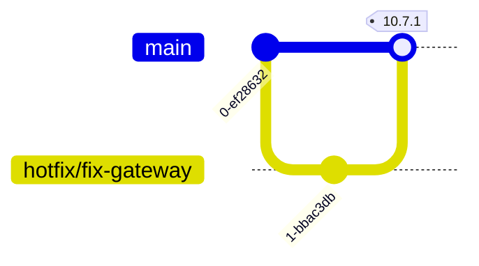

# Release Strategy

Defining a release strategy is important for a team to be able to achieve continuous delivery.

A release strategy will include definition and alignment on the following:
* GitHub branch strategy
* Environment strategy
* JIRA ticket strategy

This document is focused on the GitHub branching and environment strategy.

-----
### Goal: A branching strategy that allows us to achieve continuous delivery

### Environment branches (disadvantages)
* By having a branch dedicated for all development work defeats the purpose of continuous delivery
* You can forget to take dev or qa to production - so you have functionality that is not in production
* Environment specific code, configuration and other drift

### Need the following
* Less intermediate environments
  * Less environments encourages team to use shared environment optimally
* Remove environment specific branches
  * By avoiding branches for environments we focus on production and moving new features forward.
* Create JIRA tickets as deployable units 

### Important notes
* Anything in master is deployable and ready for production
* To work on something new, create branch off of master
* Need to continue to merge/rebase from master and make sure envs are up-to-date
* If the team is overwhelmed with testing there is not enough automation
* Automation is key to continuous delivery

### Branch Names
* Need to follow release, techdebt, hotfix for the following reasons:
  * Metrics and analytics on allocation in Swarmia
  * CI pipeline will only build code on certain branch names
  * GitHub branch rules enforced by name
* Need to put link to JIRA ticket in the GitHub PR.
  * Allows JIRA and GitHub integration to work

## Flow Diagrams

-----
Influenced by current experience and observation at Katapult. A lot of references and agreement with the [following article](https://sairamkrish.medium.com/git-branching-strategy-for-true-continuous-delivery-eade4435b57e)
